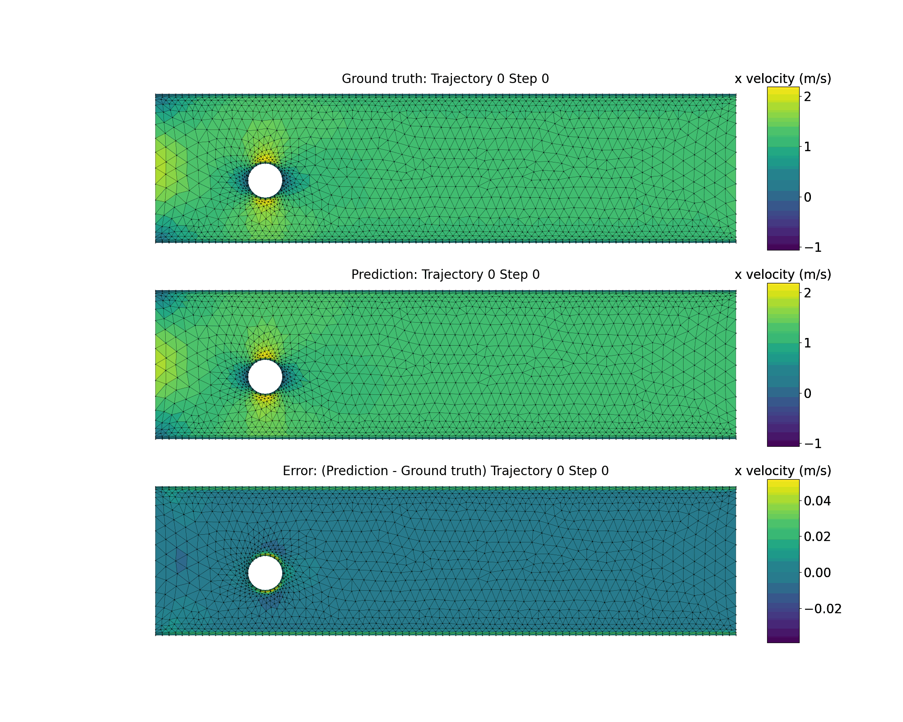
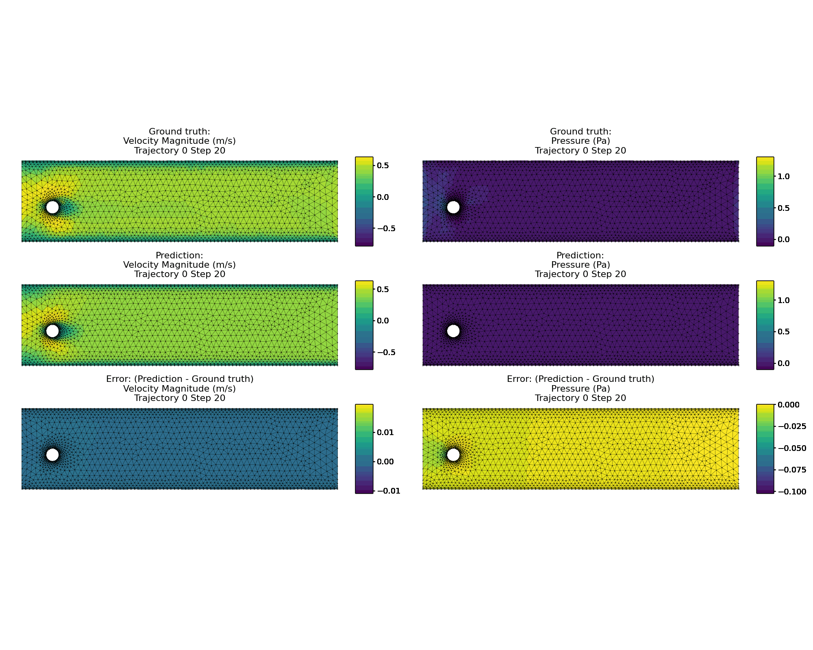

Meshgraphnet_pytorch
PyTorch implementation of MeshGraphNet (GNN) with three benchmark studies:

<table>
  <tr>
    <th>Deformed Flag</th>
    <th>CFD</th>
    <th>Deformed Plate</th>
  </tr>
  <tr>
    <td></td>
    <td></td>
    <td></td>
  </tr>
</table>


# Dataset Download 
Navigate to the dataset directory
```
cd path/to/dataset/directory
```
Run the following command to generate the .idx file:
```
python -m tfrecord.tools.tfrecord2idx <file>.tfrecord <file>.idx
```

# Excute
```
python deformedflag.py
python cfd.py
python deformedplate.py
```

# Hyperparameter tune 
Timestep > hidden dimension == Layer > epoch > batch  

-Timestep: flag:5e-3, cfd: 1e-4  

-hidden dimension > 64  

-layer > 20  

-epoch < 100  

-batch ..  

# Predict Multifields

<table>
  <tr>
    <th>Velocity/pressure</th>
    <th>displacement/velocity</th>
  </tr>
  <tr>
    <td></td>
    <td></td>
  </tr>
</table>


# References

1. https://github.com/google-deepmind/deepmind-research
2. https://medium.com/stanford-cs224w/learning-mesh-based-flow-simulations-on-graph-networks-44983679cf2d
3. https://github.com/wwMark/meshgraphnets


